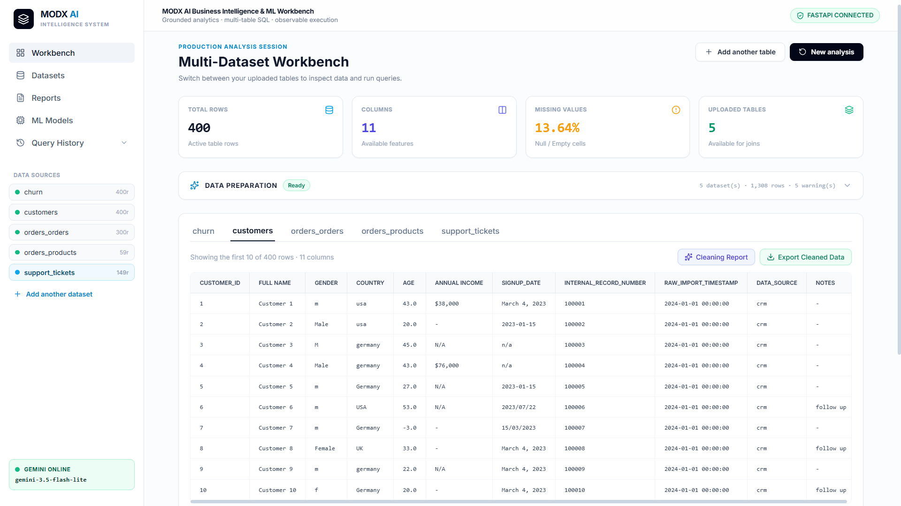
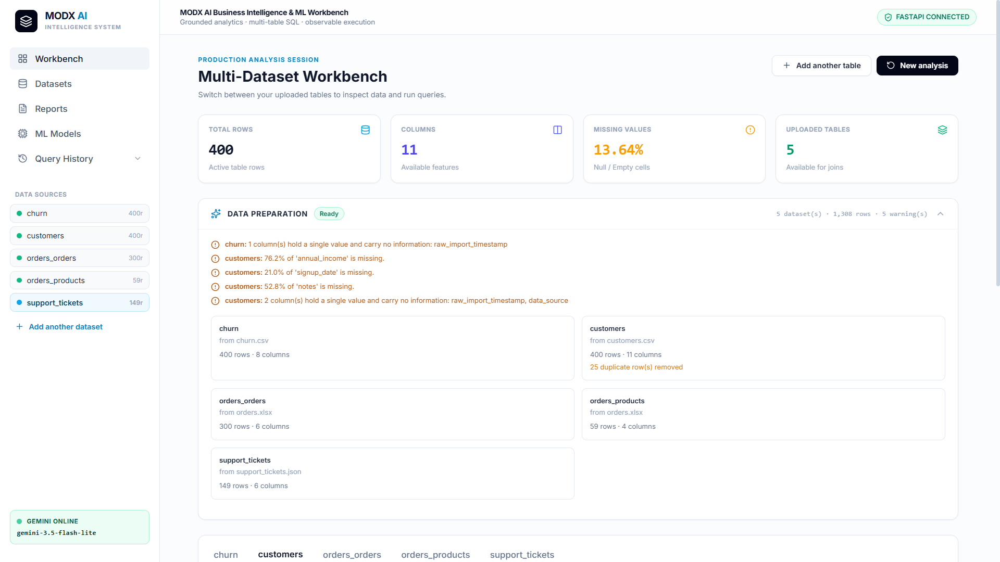
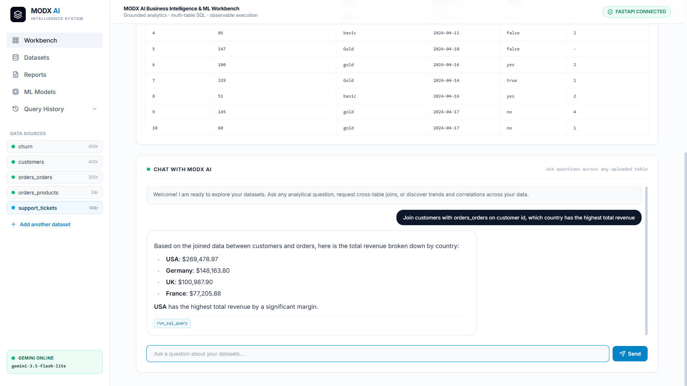
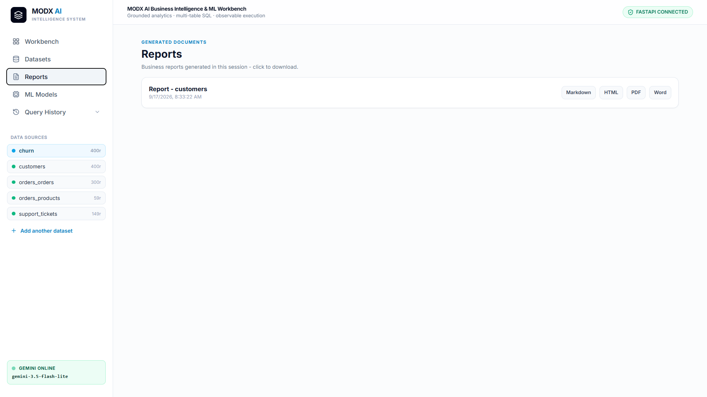
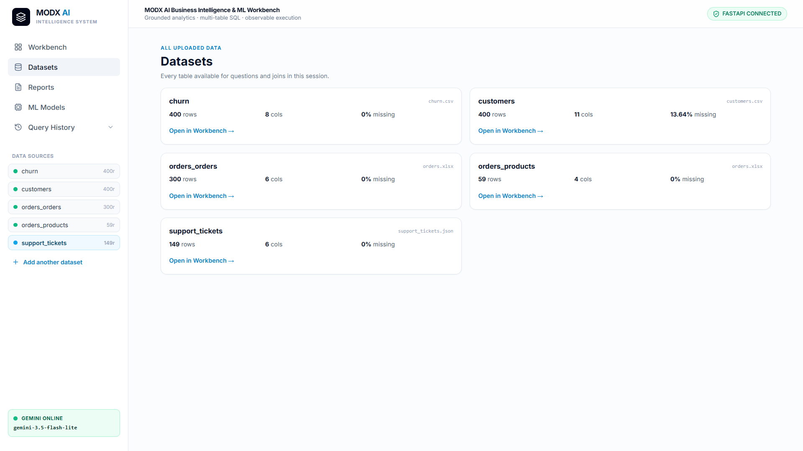
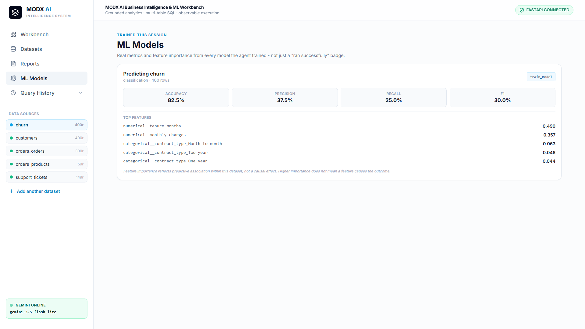
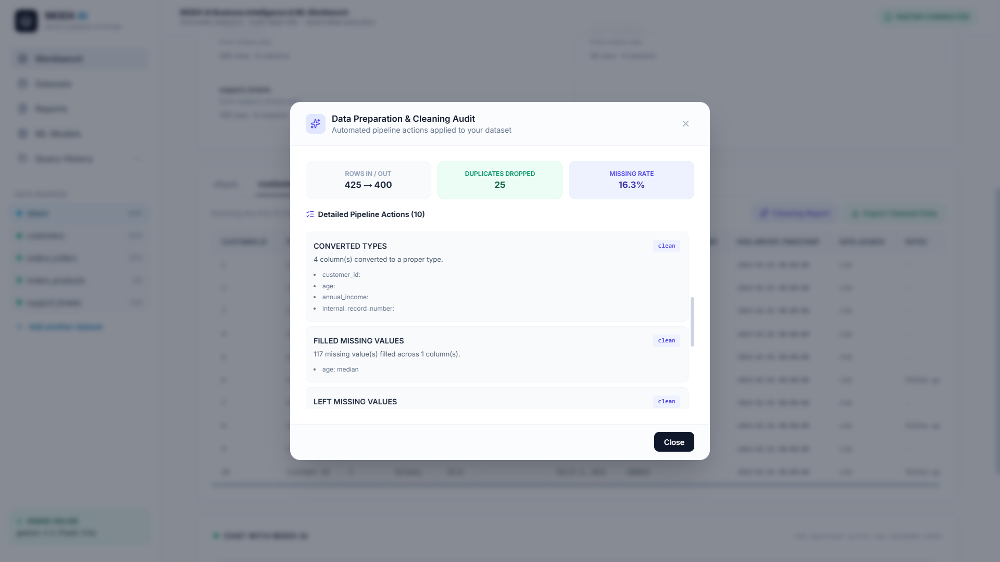
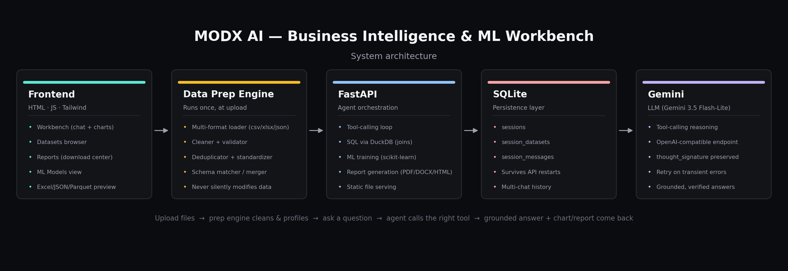

# MODX AI — Business Intelligence & ML Workbench


An agentic backend + UI that turns messy, real-world files (mismatched
delimiters, multi-sheet Excel workbooks, nested JSON) into a clean,
queryable workspace — then answers natural-language business
questions about them with real tool calls (SQL joins, statistics,
trend/anomaly detection, ML training, visualization, and automated
report generation/delivery), grounded in verified tool output, never
invented.

> **Why this exists:** most "chat with your data" projects assume the
> data already arrives clean. This one starts from the assumption
> that it doesn't — and treats knowing what it *can't* safely fix
> automatically as important as the AI layer on top of it.

<p align="center">
  
  
</p>
<p align="center">
  
  
</p>
<p align="center">
  
  
</p>
<p align="center">
  
</p>

## At a glance

| | |
|---|---|
| 🧹 **Handles messy input** | Wrong CSV delimiters, multi-sheet Excel, nested JSON — cleaned and profiled automatically before any question is asked |
| 🛑 **Never guesses on ambiguous data** | Flags negative values, out-of-range ages, high missing rates — reports them instead of silently "fixing" them |
| 🔗 **Real multi-table SQL** | Joins across every uploaded table via DuckDB, not single-table lookups |
| 📊 **Grounded answers only** | Every number traces back to a real tool call — no tool call, no claim |
| 📈 **Charts + reports, not just text** | Real matplotlib charts inline in chat *and* embedded in PDF/Word/HTML reports |
| 🤖 **Real ML, real metrics** | scikit-learn training with actual accuracy/F1/feature-importance, not a "done!" badge |

---


## Contents

1. [What this is](#1-what-this-is)
2. [Architecture](#2-architecture)
3. [The Data Preparation Engine](#3-the-data-preparation-engine)
4. [Available tools](#4-available-tools)
5. [Business reports](#5-business-reports)
6. [ML Models](#6-ml-models)
7. [Frontend](#7-frontend)
8. [Reliability & safety](#8-reliability--safety)
9. [Installation](#9-installation)
10. [Environment variables](#10-environment-variables)
11. [Project structure](#11-project-structure)
12. [Limitations](#12-limitations)

---

## 1. What this is

Most "chat with your data" demos assume the data already arrives
clean. This one doesn't. Upload a CSV with a semicolon delimiter, an
Excel file with two unrelated sheets, and a JSON file with nested
objects and inconsistent booleans (`"yes"` vs `false`) — the **Data
Preparation Engine** loads, profiles, cleans, and validates all of
them into consistent tables before the agent ever sees a question,
and tells you exactly what it found and what it did *not* fix (see
section 3).

From there, a tool-calling agent (Gemini) answers questions by
calling real Python functions — SQL joins across the tables you
uploaded, trend analysis, anomaly detection, model training, chart
generation — and reasons only over what those tools actually
returned. Every answer can be traced back to a specific tool call; if
no tool can answer the question honestly, the agent says so instead
of guessing.

## 2. Architecture

<p align="center">
  
</p>

```
Frontend (frontend/index.html)     -- vanilla HTML/JS + Tailwind, no build step
        |  REST (JSON) over HTTP
        v
FastAPI backend (app/api/main.py)
        |
        +--> Data Preparation Engine (app/data_engine/) -- runs once per upload
        |         loader -> profiler -> validator -> cleaner -> standardizer
        |         -> deduplicator -> schema_matcher/merger
        |
        +--> Agent (app/agent/agent.py) -- tool-calling loop
        |         calls into app/tools/* (SQL, stats, trends, anomalies,
        |         ML, visualization, reports) with the *prepared* CSVs
        |
        +--> SQLite (app/agent/memory.py) -- sessions, datasets, chat history
        |
        +--> Gemini (via its OpenAI-compatible endpoint) -- the LLM itself
```

The frontend never talks to Gemini directly and never sees raw
uploaded files — everything goes through the FastAPI backend, which
is the only thing that touches the prepared data, the database, and
the model.

## 3. The Data Preparation Engine

This is the part that makes uploading real (messy) files work at
all, and it is deliberately conservative: **it reports data quality
issues, it does not silently guess how to fix them.**

| Stage | File | What it does |
|---|---|---|
| Load | `loader.py` | Reads CSV (auto-detects delimiter), Excel (every sheet becomes its own table, named `file_sheet`), and JSON/JSONL (including nested objects) |
| Profile | `profiler.py` | Row/column counts, dtypes, missing rates, cardinality |
| Validate | `validator.py` | Flags missing-value rates, out-of-range values (e.g. ages outside 0-120), negative values in columns whose name implies non-negative, constant/single-value columns — **read-only, never modifies data** |
| Clean | `cleaner.py` | Safe, unambiguous fixes only (e.g. whitespace, type coercion) — never drops rows or guesses at ambiguous values |
| Deduplicate | `deduplicator.py` | Removes exact duplicate rows |
| Standardize | `standardizer.py` | Consistent column naming/typing |
| Match & merge | `schema_matcher.py`, `merger.py` | Detects related tables across uploads for later SQL joins |

The reasoning behind the "report only" design, straight from the
code:

> *"Deciding that a -5 quantity is a data-entry error rather than a
> return is a business judgement, so it surfaces as a warning for the
> user and the agent rather than being silently rewritten."*

The full preparation report (every warning, per table) is shown in
the UI right after upload, and is also summarized for the agent so
it can mention relevant caveats (e.g. "note that 76% of annual_income
is missing") when answering a question that touches a flagged column.

## 4. Available tools

| Tool | Purpose |
|---|---|
| `get_dataset_info` / `get_dataset_profile` / `get_dataset_statistics` | Row/column counts, dtypes, missing rates, summary stats |
| `analyze_column` | Distribution/summary of a single column |
| `compare_categories` / `rank_categories` | Group-by comparisons and rankings |
| `run_sql_query` | Validated, read-only SQL via DuckDB — including joins across multiple uploaded tables |
| `analyze_trends` / `compare_periods` | Time-series trend analysis and period-over-period comparison |
| `detect_anomalies` | IQR + Z-score outlier detection |
| `create_visualization` / `create_churn_plot` | Real matplotlib charts, returned as image files |
| `train_model` / `analyze_churn` | scikit-learn model training with real metrics + feature importance |
| `assess_feature_relevance` | Flags which columns are safe/unsafe to use as ML features |
| `generate_report` / `generate_business_report` | Full report generation (see section 5) |
| `deliver_business_report` | Generates + optionally emails a report via SMTP |
| `semantic_search` | Embedding-based search over text columns |

Every tool call is logged (`tools_used`, `tool_log` in the API
response) and shown to the user, so an answer's provenance is never
hidden.

## 5. Business reports

`generate_business_report` produces a real, multi-format document —
not just a chat answer:

- **Markdown, HTML, PDF, and Word (.docx)**, all generated from the
  same underlying content so they never drift out of sync.
- **Real embedded charts** (`report_tools.py` calls matplotlib
  directly) — a trend line and a top/bottom performers bar chart,
  the same kind of chart the Workbench shows inline, base64-embedded
  into the HTML report and saved as PNGs for the PDF/DOCX versions.
- Optional email delivery over SMTP, with the PDF attached — and the
  response always says explicitly whether the email actually sent,
  never a false "delivered."

All four files are downloadable from the **Reports** tab in the UI,
and from a download row that appears directly under the chat answer
when a report is generated mid-conversation.

## 6. ML Models

`train_model` accepts an explicit `feature_columns` list (important:
without it, every other column becomes a feature, including
high-cardinality timestamp/ID columns that can make one-hot encoding
explode and training hang — the tool now caps this automatically at
50 unique values even if `feature_columns` is omitted).

Every training run's real metrics (accuracy/precision/recall/F1 or
MAE/RMSE depending on task type) and top feature importances are
surfaced in the **ML Models** tab — not just a "ran successfully"
badge — via a dedicated `ml_result` field threaded through the API
response the same way chart/report paths are.

## 7. Frontend

Single-file vanilla HTML/JS (`frontend/index.html`, no build step,
no framework) with four real views:

- **Workbench** — chat with the agent; answers render as formatted
  Markdown (headings, tables, code blocks) via `marked.js` +
  Tailwind Typography, with inline chart images and report/ML
  callouts.
- **Datasets** — every uploaded/prepared table, with a real
  in-browser row preview for CSV, Excel (via SheetJS), JSON/JSONL,
  and Parquet (via `hyparquet`) — not just a "preview unavailable"
  placeholder.
- **Reports** — every report generated this session, with working
  download links for all four formats.
- **ML Models** — every model trained this session, with real
  metrics and feature importance.

## 8. Reliability & safety

- The data preparation engine never silently modifies ambiguous data
  (see section 3) — flagged issues stay flagged until a human (or an
  explicit agent instruction) decides what to do about them.
- `run_sql_query` validates every query before execution (safe
  `SELECT`s only; destructive statements are rejected).
- `deliver_business_report` only reports success after confirming
  the files exist on disk and the SMTP send didn't raise.
- Gemini 3.x models attach a `thought_signature` to function calls
  that must be echoed back verbatim on the next turn or the API
  rejects the request — this is handled transparently in
  `agent.py`'s message normalization.
- Transient network failures (a reset connection to the LLM
  endpoint) are retried automatically with backoff before surfacing
  an error.
- Sessions, datasets, and full chat history persist to SQLite, not
  process memory — a chat survives an API restart and can be
  resumed by name (auto-titled from the dataset or the first
  question asked).

## 9. Installation

```bash
git clone <this repo>
cd <repo-folder>
pip install -r requirements.txt
cp env.example .env   # fill in GEMINI_API_KEY at minimum
python -m uvicorn app.api.main:app --reload --port 8000
```

Then open `frontend/index.html` directly in a browser (or serve it
with any static file server) — it talks to the API at
`http://127.0.0.1:8000` by default.

## 10. Environment variables

| Variable | Required | Notes |
|---|---|---|
| `GEMINI_API_KEY` | Yes | Free key at [aistudio.google.com](https://aistudio.google.com) |
| `GEMINI_MODEL` | No | Default `gemini-3.5-flash-lite` — chosen for its much higher free-tier daily quota than `gemini-3.6-flash` |
| `SMTP_HOST` / `SMTP_PORT` / `SMTP_USER` / `SMTP_PASSWORD` | No | Only needed for email report delivery |
| `UPLOAD_DIR` / `OUTPUT_DIR` / `SESSIONS_DB_PATH` | No | Sensible defaults; override for deployment |

See `env.example` for the full list with defaults.

## 11. Project structure

```
app/
  agent/          agent.py (tool-calling loop), memory.py (SQLite sessions)
  api/            main.py (FastAPI routes), schemas.py (request/response models)
  data_engine/    loader, profiler, validator, cleaner, deduplicator,
                  standardizer, schema_matcher, merger, pipeline, report
  tools/          one file per tool category (sql, ml, trend, anomaly,
                  visualization, report, automation, semantic search)
frontend/
  index.html      the entire UI
```

## 12. Limitations

- The Data Preparation Engine's cleaning is intentionally
  conservative — it will not resolve ambiguous data-quality issues
  (out-of-range values, negative-where-non-negative, high missing
  rates) on its own; a human decides what those mean.
- Sessions persist to a single SQLite file — fine for a
  single-process deployment, not a multi-worker production setup.
- `semantic_search` does embedding-based retrieval over text columns,
  not a full document-chunking RAG pipeline.
- Gemini's free tier has real daily request quotas that vary by
  model; `gemini-3.5-flash-lite` was chosen specifically for having
  a much higher one than newer flagship models.

---

<p align="center">
  If this is useful or interesting, a ⭐ on the repo is appreciated.
  <br/>
  Feedback and PRs welcome.
</p>
